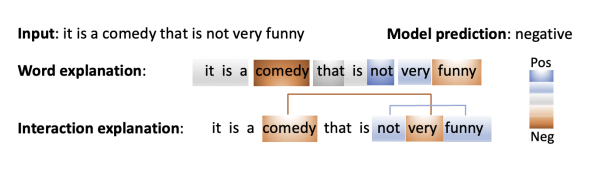

# ASIV
Implementation of ASIV described in our research work [Asymmetric feature interaction for interpreting model predictions](https://arxiv.org/abs/2305.07224).

Studying word interaction could help identify to what extent a set of words exert influence in combination as opposed to independently. However, most interaction attribution methods assume symmetric interaction, which may fail to capture asymmetric influence that contributes to model prediction. For example, in individuallevel explanation “funny” has negative influence while the symmetric interaction between “funny"
and “not" produces positive influence to model prediction. Therefore the influence of the presence of “not” to “funny” is not the same as that of the presence of “funny” to “not". 

This work is the first step toward providing the explanation that incorporates asymmetric feature interaction, and our research aims to abstract complex feature interactions in deep NLP models.

 
 
 

 

  Fig.1. Explanations for a negative movie review
(computed by Shapley value and Shapley interaction
index), where the color indicates contribution of the
corresponding word/pairwise word interaction to the
model prediction.

 
 

## Examples 
#### _(We still work on improving the efficiency of ASIV and this repo is actively maintained.)_
* **Basic configuration:** pytorch == 1.12.1, python == 3.8.15, numpy == 1.24.0
* **Src:**  
  * Train NLP model: training_model.py
  * ASIV algorithm: asiv.py
  * Run ASIV to generate interaction explanation: compute_asiv.py
* A hypergraph structure could be pre-defined and use ASIV to compute the weight of hyperedge.

## Our pretrained LM (BERT + RoBERTa)
[SST](https://drive.google.com/drive/folders/1HDIUoIqkxACfSPcKHvlgz_m1IiucZMyX?usp=share_link) / [Yelp2](https://drive.google.com/drive/folders/1nZ9WOX6m7EsZGTZFeFZmc67N0pofUE20?usp=share_link)
_(The pretrained LM could be improved and you could customize pretrain section)_

